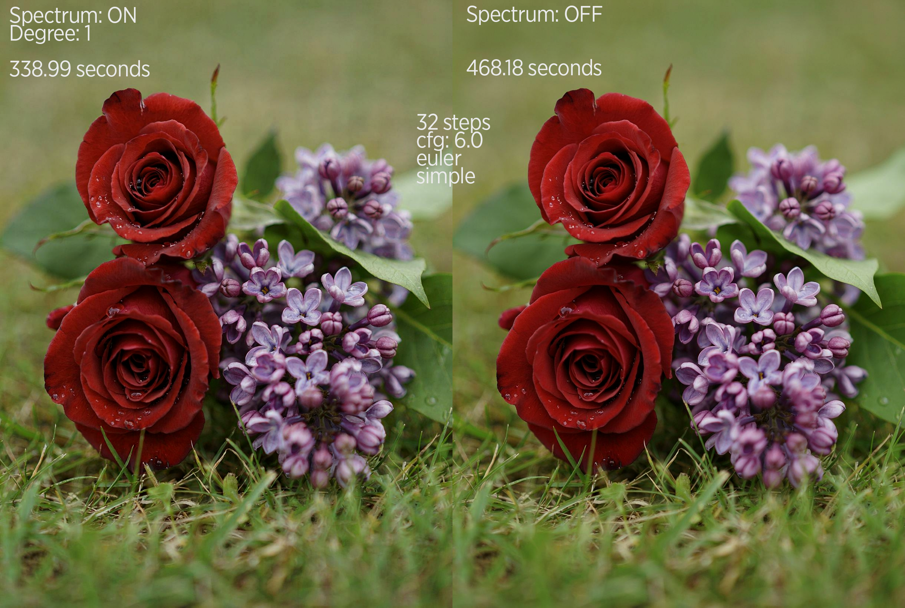

# Spectrum for Ideogram 4

This custom node adds Spectrum feature forecasting to ComfyUI's native
Ideogram 4 transformer. It reduces full transformer evaluations by forecasting
image-token features between selected actual evaluations, while retaining the
native Ideogram output head and automatically falling back to an actual
evaluation when the forecast is not safe.

## Usage

Add `Spectrum Apply Ideogram 4` after each Ideogram 4 model you want to
accelerate. For the two-model Ideogram workflow, use the regular model as
`model` and the unconditional model as `model_negative` in `DualModelGuider`.
Apply the node to both models with the same settings. Their forecast histories
are kept separate while the sampler schedule is coordinated by the regular
model.

The node requires ComfyUI's native
`Ideogram4Transformer2DModel`. Spectrum step tracking is supported for Euler,
Euler CFG++, RES multistep, and RES multistep CFG++; other samplers continue
through the native path.

The main controls are warmup and tail actual steps, forecast blend weight,
polynomial degree, adaptive window, history size, and history storage. Enable
debug logging when tuning or diagnosing a workflow.
